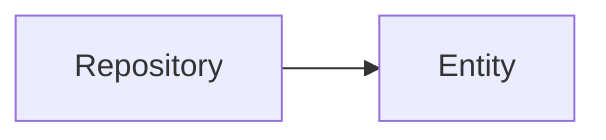

## TOC

*   [Objective](#objective)

*   [REST API Architecture](#rest-api-architecture)

    *   [HTTP](#http)

    *   [HTTP request](#http-request)

    *   [HTTP methods](#http-methods)

    *   [HTTP response](#http-response)

    *   [Code status](#code-status)

*   [From REST to RESTful](#from-rest-to-restful)

    *   [Richardson Maturity Model (RMM)](#richardson-maturity-model-rmm)

    *   [Level 0: Swamp of POX (plain old XML):](#level-0-swamp-of-pox-plain-old-xml)

    *   [Level 1: Resources:](#level-1-resources)

    *   [Level 2: HTTP methods](#level-2-http-methods)

    *   [Level 3: Hypermedia controls](#level-3-hypermedia-controls)

    *   [REST API limitations](#rest-api-limitations)

*   [Initializing the project](#initializing-the-project)

*   [Creating entities](#creating-entities)

*   [Creating the database](#creating-the-database)

    *   [Transform entity into table](#transform-entity-into-table)

*   [Fixtures](#fixtures)

*   [Create a route](#create-a-route)

    *   [Create a findAll() route](#create-a-findall-route)

    *   [Create a find($id) route](#create-a-findid-route)

*   [Faker](#faker)

## Objective

Develop a complete REST API using PHP and Symfony.

## REST API Architecture

An API is an application: Application Programming Interface.

The aim of an API: to manage resources (text, images, files, etc.).

This management is done via HTTP actions: GET, POST, DELETE, PUT.

REST is an architecture: Representational State Transfer.

It is a workframe for consistent API development.

APIs are developed by developers for developers.

In short, they are a set of actions configured to manage given resources.

### HTTP

HTTP is a protocol, a communication method between two computers.

An API is an app that receives an HTTP request and serves a HTTP response.

### HTTP request

An HTTP request is made by a client and contains:

2.  The HTTP method (GET, POST, etc.)

3.  A URI (what comes after the domain name)

4.  The protocol version

5.  The headers

6.  The body (the content of the request)

HTTP post request example:

```
POST /users HTTP/1.1 User-Agent:Mozilla/5.0 (Macintosh; Intel Mac OS X 10_12_2)
AppleWebKit/537.36 (KHTML, like Gecko) Chrome/55.0.2883.95 Safari/537.36
Content-Type: application/x-www-form-urlencoded Content-Length: 28 name=Sarah
Khalil&job=auteur
```

### HTTP methods

1.  GET: retrieve information related to the URI

    1.  Safe method since it doesn't write modify data on the server

    2.  Idempotent: the API must always send the same response for a same request

2.  POST: create a resource on the server with needed data within the body

3.  PUT: replace information of a resource on the server with needed data within the body

4.  PATCH: alter information of a resource on the server with desired action within the body

5.  DELETE: remove a resource from the server for a given URI

6.  OPTIONS: obtain information on possible actions that can be made on a resource

7.  CONNECT: establish a first connection with the server for a given URI

8.  HEAD: same as GET, but only headers are served

9.  TRACE: trace the server path taken by the request

### HTTP response

An HTTP response is served by the server and contains:

2.  The protocol version

3.  The status code (200, 404, etc.)

4.  The status code in text (OK, Not found, etc.)

5.  The headers

6.  The body (the content of the response)

HTTP response example:

```
HTTP/1.1 200 OK Date:Tue, 31 Jan 2017 13:18:38 GMT Content-Type: application/json {
 "current status" : "Everything is ok!" }
```

### Code status

1.  1xx: information: used to inform the client

2.  2xx: success: everything went well

3.  3xx: redirections

4.  4xx: error coming from the request (client)

5.  5xx: error coming from the server

## From REST to RESTful

### Richardson Maturity Model (RMM)

Since REST is an architecture (convention), the more an API is RESTful, the more organized and understandable it will be for developers.

This model helps measure that RESTfulness.

There are four levels.

### Level 0: Swamp of POX (plain old XML):

In applications communication, there is the concept of encapsulation:

*   Applications within a system can integrate (share data) by calling each other directly over a network.

*   Encapsulation reduces the need for duplicate data within each application.

*   However, a system with many calls can become a knot and create issues.

    *   _People often design the integration the way they would design a single application, unaware that the rules change. -_ Gregor Hohpe

*   In practice, a level 0 API can usually be queried on a single point of entry for all actions.

*   In this example `/appointmentService`

```

-> Request
POST /appointmentService HTTP/1.1
[various other headers]

<openSlotRequest date = "2010-01-04" doctor = "mjones"/>

<- Reply
HTTP/1.1 200 OK
[various headers]

<openSlotList>
  <slot start = "1400" end = "1450">
    <doctor id = "mjones"/>
  </slot>
  <slot start = "1600" end = "1650">
    <doctor id = "mjones"/>
  </slot>
</openSlotList>

-> Request
POST /appointmentService HTTP/1.1
[various other headers]

<appointmentRequest>
  <slot doctor = "mjones" start = "1400" end = "1450"/>
  <patient id = "jsmith"/>
</appointmentRequest>

<- Reply
HTTP/1.1 200 OK
[various headers]

<appointment>
  <slot doctor = "mjones" start = "1400" end = "1450"/>
  <patient id = "jsmith"/>
</appointment>
```

### Level 1: Resources:

Instead of having one point of entry, a level 1 API has many, using ids.

*   In this example `/doctors/mjones`, the doctor and the slots are targeted individually via the URI:

```
-> Request
POST /doctors/mjones HTTP/1.1
[various other headers]

<openSlotRequest date = "2010-01-04"/>

<- Reply
HTTP/1.1 200 OK
[various headers]


<openSlotList>
  <slot id = "1234" doctor = "mjones" start = "1400" end = "1450"/>
  <slot id = "5678" doctor = "mjones" start = "1600" end = "1650"/>
</openSlotList>

-> Request
POST /slots/1234 HTTP/1.1
[various other headers]

<appointmentRequest>
  <patient id = "jsmith"/>
</appointmentRequest>

<- Reply
HTTP/1.1 200 OK
[various headers]

<appointment>
  <slot id = "1234" doctor = "mjones" start = "1400" end = "1450"/>
  <patient id = "jsmith"/>
</appointment>
```

*   The main difference is we can now call a method on one particular resource by providing arguments in the URI:

    *   To update an appointment for example `http://hospital.com/slots/1234/update-method`

### Level 2: HTTP methods

A level 2 API leverages HTTP verbs for requests and HTTP error codes for replies:

```
-> Request
GET /doctors/mjones/slots?date=20100104&status=open HTTP/1.1
Host: royalhope.nhs.uk

<- Reply
HTTP/1.1 200 OK
[various headers]

<openSlotList>
  <slot id = "1234" doctor = "mjones" start = "1400" end = "1450"/>
  <slot id = "5678" doctor = "mjones" start = "1600" end = "1650"/>
</openSlotList>

-> Request
POST /slots/1234 HTTP/1.1
[various other headers]

<appointmentRequest>
  <patient id = "jsmith"/>
</appointmentRequest>

<- Reply
HTTP/1.1 201 Created
Location: slots/1234/appointment
[various headers]

<appointment>
  <slot id = "1234" doctor = "mjones" start = "1400" end = "1450"/>
  <patient id = "jsmith"/>
</appointment>
```

*   By using HTTP verbs, we can omit the action in level 1 `http://hospital.com/slots/1234/update-method`

    *   We can now use GET to receive information, POST to change state, PUT to update information, etc. all using the same URI.

*   By using GET (a safe method not changing state), we can leverage caching, a key concept in web.

*   It's important to leverage safe (GET) vs non-safe actions, plus status codes in replies.

    *   The clearer status codes are, the higher the quality of the API.

### Level 3: Hypermedia controls

*   This level introduces HATEOAS (Hypertext as the Engine of Application State):

```
-> Request
GET /doctors/mjones/slots?date=20100104&status=open HTTP/1.1
Host: royalhope.nhs.uk

<- Reply
HTTP/1.1 200 OK
[various headers]

<openSlotList>
  <slot id = "1234" doctor = "mjones" start = "1400" end = "1450">
     <link rel = "/linkrels/slot/book"
           uri = "/slots/1234"/>
  </slot>
  <slot id = "5678" doctor = "mjones" start = "1600" end = "1650">
     <link rel = "/linkrels/slot/book"
           uri = "/slots/5678"/>
  </slot>
</openSlotList>

-> Request
POST /slots/1234 HTTP/1.1
[various other headers]

<appointmentRequest>
  <patient id = "jsmith"/>
</appointmentRequest>

<- Reply
HTTP/1.1 201 Created
Location: http://royalhope.nhs.uk/slots/1234/appointment
[various headers]

<appointment>
  <slot id = "1234" doctor = "mjones" start = "1400" end = "1450"/>
  <patient id = "jsmith"/>
  <link rel = "/linkrels/appointment/cancel"
        uri = "/slots/1234/appointment"/>
  <link rel = "/linkrels/appointment/addTest"
        uri = "/slots/1234/appointment/tests"/>
  <link rel = "self"
        uri = "/slots/1234/appointment"/>
  <link rel = "/linkrels/appointment/changeTime"
        uri = "/doctors/mjones/slots?date=20100104&status=open"/>
  <link rel = "/linkrels/appointment/updateContactInfo"
        uri = "/patients/jsmith/contactInfo"/>
  <link rel = "/linkrels/help"
        uri = "/help/appointment"/>
</appointment>
```

*   Here, the response provides links with URIs:

    *   It tells us what can be done (rel) and how (uri).

Remember, REST is a model to improve interactions between HTTP services:

```
[The attractiveness of this model is] its relationship to common design techniques:

- Level 1 tackles the question of handling complexity by using **divide and conquer**, breaking a large service endpoint down into multiple resources.

- Level 2 introduces a standard set of verbs so that we handle similar situations in the same way, **removing unnecessary variation**.

- Level 3 introduces **discoverability**, providing a way of making a protocol more self-documenting.

The result is a model that **helps us think about the kind of HTTP service we want to provide** and frame the expectations of people looking to interact with it.
```

Source: [https://martinfowler.com/articles/richardsonMaturityModel.html](https://martinfowler.com/articles/richardsonMaturityModel.html)

### REST API limitations

1.  Client / Server:

    1.  The client makes an HTTP request (browser, React app)

    2.  The server serves a response to the request (Symfony app)

2.  Stateless:

    1.  There is no relationship between requests

    2.  There is no session on the server, only on the client

3.  Cache HTTP: avoid generating a same response twice (resource management)

4.  Layout: a client must receive a response, regardless of what happens on the server

5.  Uniform interface: a resource must have:

    1.  An unique identifier (ID, UID)

    2.  Data (e.g. JSON)

    3.  Autodescription: header (XML, JSON, HTML)

6.  Code on demand (optional): a server can send scripts to the client, who executes them or not

## Initializing the project

```
symfony new Books
cd Books
symfony server:start -d
```

This command generates a 10MB boilerplate, which is light.

However, it doesn't include Symfony Profiler for debugging.

The `composer require webapp`command installs it with other bundles, but increases the size of the project to 100MB.

I tested installing the Profiler bundle via the command:

```
composer require symfony/web-profiler-bundle --dev
```

The file size stayed light at 15MB, and Twig was installed as well.

## Creating entities

An entity is a data model.

For the moment, we have three bundles installed (sort of plug-ins): Symfony, Twig and Profiler.

```
<?php

return [
    Symfony\Bundle\FrameworkBundle\FrameworkBundle::class => ['all' => true],
    Symfony\Bundle\TwigBundle\TwigBundle::class => ['all' => true],
    Symfony\Bundle\WebProfilerBundle\WebProfilerBundle::class => ['dev' => true, 'test' => true],
];
```

To create an entity, we need to install the maker bundle to benefit from Symfony's automation:

```
 composer require symfony/maker-bundle --dev
```

The file size is now at 20MB.

We need to install a last bundle, Doctrine.

Doctrine is an ORM (Object Relational Mapper).

It translates tables (relational databases) into objects (JSON) and viceversa.

```
composer require orm
```

Installing Doctrine increases the file size to 30MB.

The bundle set up now looks like this:

```
<?php

return [
    Symfony\Bundle\FrameworkBundle\FrameworkBundle::class => ['all' => true],
    Symfony\Bundle\TwigBundle\TwigBundle::class => ['all' => true],
    Symfony\Bundle\WebProfilerBundle\WebProfilerBundle::class => ['dev' => true, 'test' => true],
    Symfony\Bundle\MakerBundle\MakerBundle::class => ['dev' => true],
    Doctrine\Bundle\DoctrineBundle\DoctrineBundle::class => ['all' => true],
    Doctrine\Bundle\MigrationsBundle\DoctrineMigrationsBundle::class => ['all' => true],
];
```

To create an entity:

```
symfony console make:entity
```

This command creates an entity and a repository, the repository being a sort of manager of the entity:

<br/>

<!--MERMAID {width:100}-->

<!--MCONTENT {content: "graph LR<br/>\nRepository \\-\\-\\> Entity<br/>"} --->

<br/>

## Creating the database

To connect Symfony to a database, we use the `.env` file.

Sensitive data like database logins should never be pushed to GitHub.

This is why it is good practice to use the `.env` file like a template:

*   You can copy it to create `.env.local`, `.env.dev` and `.env.prod`, according to Symfony's environments.

Copy `.env` into `.env.local` and declare the database's path and name:

```
DATABASE_URL="mysql://root:@127.0.0.1:3306/databaseName"
```

Now run the following command to create the database in mySQL:

```
symfony console doctrine:database:create
```

To check if the connection is successful (should return 1):

```
symfony console dbal:run-sql "SELECT 1"
```

### Transform entity into table

```
symfony console doctrine:schema:update --force
```

The `--force` flag removes confirmation.

However, it would be best to use `migrations`.

## Fixtures

Fixtures are fake or test data we can use to test our app.

This feature comes as a bundle:

```
composer require orm-fixtures --dev
```

Our file size is now 30MB.

Now, we need to specify how the fake data is created:

```php
for ($i = 0; $i < 20; $i++) {
            $livre = new Book;
            $livre->setTitle('Livre ' . $i);
            $livre->setCoverText('Quatrième de couverture numéro : ' . $i);
            $manager->persist($livre);
        }
        $manager->flush();
```

We then have to run the command to persist the data to the DB:

```
symfony console doctrine:fixtures:load
```

## Create a route

A route is specified within a controller:

```
symfony console make:controller ControllerName
```

This command creates a controller skeleton out of the box.

The following changes have been made to the skeleton:

1.  Add `/api` prefix: not mandatory but useful.

2.  Change `book` to `books`: also a common practice.

3.  Replace `Response` with `JsonResponse`: more precise.

4.  Replace `return $this->json`with `return new JsonResponse`: more precise.

5.  Add `methods: ['GET']`: specify that only GET requests can be processed.

PHP is an object-oriented language, so it can output data in JSON format.

However, complex data can be challenging to turn into JSON.

This process called serialization can be automated using a Symfony component `serializer`:

```
composer require symfony/serializer-pack
```

The `JsonResponse` can now be processed using `serializer`, and given four arguments:

1.  The serialized data

2.  The code status of the reply

3.  The headers

4.  If the data has been serialized, `true`

<br/>

Create a findAll() route
<!-- NOTE-swimm-snippet: the lines below link your snippet to Swimm -->
### 📄 src/Controller/BookController.php
```hack
44         #[Route('/books', name: 'book', methods: ['GET'])]
45         public function getAll(): JsonResponse
46         {
47             $jsonData = $this->crudService->getAll($this->bookRepository, $this->serializer, ['getBooks']);
48             return new JsonResponse($jsonData, Response::HTTP_OK, [], true);
49         }
50     
51         // public function getBookList(BookRepository $bookRepository, SerializerInterface $serializer): JsonResponse
52         // {
53     
54         //     $bookList = $bookRepository->findAll();
55         //     $jsonBookList = $serializer->serialize($bookList, 'json', ['groups' => 'getBooks']);
56     
57         //     return new JsonResponse($jsonBookList, Response::HTTP_OK, [], true);
58         // }
```

<br/>

Create a find($id) route
<!-- NOTE-swimm-snippet: the lines below link your snippet to Swimm -->
### 📄 src/Controller/BookController.php
```hack
60         #[Route('/books/{id}', name: 'detailBook', methods: ['GET'])]
61         public function getOne(Book $book): JsonResponse
62         {
63             $jsonData = $this->crudService->getOne($book, $this->serializer, ['getBooks']);
64             return new JsonResponse($jsonData, Response::HTTP_OK, [], true);
65         }
```

<br/>

Now create a new entity `Author`with a `OneToMany` relation to `Book` and migrate it using Symfony's migrations:

```
symfony console make:migration
symfony console doctine:migrations:migrate
```

### Faker

To use more realistic fake data, use the Faker library:

```
composer require fakerphp/faker
```

This brings the file size to 45MB.

<br/>

Faker fixture.
<!-- NOTE-swimm-snippet: the lines below link your snippet to Swimm -->
### 📄 src/DataFixtures/AppFixtures.php
```hack
13     class AppFixtures extends Fixture
14     {
15         private $userPasswordHasher;
16     
17         public function __construct(UserPasswordHasherInterface $userPasswordHasher)
18         {
19             $this->userPasswordHasher = $userPasswordHasher;
20         }
21     
22         public function load(ObjectManager $manager): void
23         {
24     
25             $faker = Factory::create();
26     
27             // User
28             $user = new User();
29             $user->setEmail('user@bookapi.com');
30             $user->setRoles(['ROLE_USER']);
31             $user->setPassword($this->userPasswordHasher->hashPassword($user, "password"));
32             $manager->persist($user);
33     
34             // Admin
35             $admin = new User();
36             $admin->setEmail('admin@bookapi.com');
37             $admin->setRoles(['ROLE_ADMIN']);
38             $admin->setPassword($this->userPasswordHasher->hashPassword($admin, "password"));
39             $manager->persist($admin);
40     
41             // Author
42             $listAuthor = [];
43             for ($i = 0; $i < 5; $i++) {
44                 // Création de l'auteur lui-même.
45                 $author = new Author();
46                 $author->setFirstName($faker->firstName());
47                 $author->setLastName($faker->lastName());
48                 $manager->persist($author);
49                 // On sauvegarde l'auteur créé dans un tableau.
50                 $listAuthor[] = $author;
51             }
52     
53             // Book
54             for ($i = 0; $i < 10; $i++) {
55                 $book = new Book;
56                 $book->setTitle($faker->sentence(3, true));
57                 $book->setCoverText($faker->paragraph());
58                 $publicationDate = new \DateTime($faker->date());
59                 $book->setPublicationDate($publicationDate);
60                 $book->setAuthor($listAuthor[array_rand($listAuthor)]);
61                 $manager->persist($book);
62             }
63     
64             $manager->flush();
65         }
66     }
```

<br/>

## Handling circular references

When creating relationships between entities, circular references can occur.

This will log an error when the route is tested.

`Groups` within Symfony allow to solve this by specifying which variables should be returned:

<br/>


<!-- NOTE-swimm-snippet: the lines below link your snippet to Swimm -->
### 📄 src/Entity/Book.php
```hack
11     #[ORM\Entity(repositoryClass: BookRepository::class)]
12     class Book
13     {
14         #[ORM\Id]
15         #[ORM\GeneratedValue]
16         #[ORM\Column]
17         #[Groups(['getBooks', 'getAuthors'])]
18         private ?int $id = null;
19     
20         #[ORM\Column(length: 255)]
21         #[Groups(['getBooks', 'getAuthors'])]
22         #[Assert\NotBlank(message: 'Please enter a title.')]
23         private ?string $title = null;
24     
25         #[ORM\Column(type: Types::TEXT, nullable: true)]
26         #[Groups(['getBooks'])]
27         private ?string $coverText = null;
28     
29         #[ORM\ManyToOne(inversedBy: 'books')]
30         #[ORM\JoinColumn(onDelete: 'SET NULL')]
31         #[Groups(['getBooks'])]
32         private ?Author $author = null;
```

<br/>

Here, we don't want the `$books` collection to be exposed.
<!-- NOTE-swimm-snippet: the lines below link your snippet to Swimm -->
### 📄 src/Entity/Author.php
```hack
11     #[ORM\Entity(repositoryClass: AuthorRepository::class)]
12     class Author
13     {
14         #[ORM\Id]
15         #[ORM\GeneratedValue]
16         #[ORM\Column]
17         #[Groups(['getBooks', 'getAuthors'])]
18         private ?int $id = null;
19     
20         #[ORM\Column(length: 255)]
21         #[Groups(['getBooks', 'getAuthors'])]
22         private ?string $firstName = null;
23     
24         #[ORM\Column(length: 255)]
25         #[Groups(['getBooks', 'getAuthors'])]
26         private ?string $lastName = null;
27     
28         #[ORM\OneToMany(mappedBy: 'author', targetEntity: Book::class)]
29         #[Groups(['getAuthors'])]
30         private Collection $books;
```

<br/>

Then, within the controller, the group needs to be stated:

<br/>


<!-- NOTE-swimm-snippet: the lines below link your snippet to Swimm -->
### 📄 src/Controller/BookController.php
```hack
60         #[Route('/books/{id}', name: 'detailBook', methods: ['GET'])]
61         public function getOne(Book $book): JsonResponse
62         {
63             $jsonData = $this->crudService->getOne($book, $this->serializer, ['getBooks']);
64             return new JsonResponse($jsonData, Response::HTTP_OK, [], true);
65         }
66     
67         // public function getBook(Book $book, SerializerInterface $serializer): JsonResponse
68         // {
69         //     $jsonBook = $serializer->serialize($book, 'json', ['groups' => 'getBooks']);
70         //     return new JsonResponse($jsonBook, Response::HTTP_OK, [], true);
71         // }
```

<br/>

## CRUD

<br/>

Delete
<!-- NOTE-swimm-snippet: the lines below link your snippet to Swimm -->
### 📄 src/Controller/BookController.php
```hack
60         #[Route('/books/{id}', name: 'detailBook', methods: ['GET'])]
61         public function getOne(Book $book): JsonResponse
62         {
63             $jsonData = $this->crudService->getOne($book, $this->serializer, ['getBooks']);
64             return new JsonResponse($jsonData, Response::HTTP_OK, [], true);
65         }
66     
67         // public function getBook(Book $book, SerializerInterface $serializer): JsonResponse
68         // {
69         //     $jsonBook = $serializer->serialize($book, 'json', ['groups' => 'getBooks']);
70         //     return new JsonResponse($jsonBook, Response::HTTP_OK, [], true);
71         // }
72     
73         #[Route('/books/{id}', name: 'deleteBook', methods: ['DELETE'])]
74         public function deleteBook(Book $book, EntityManagerInterface $em): JsonResponse
75         {
76             $em->remove($book);
77             $em->flush();
78     
79             return new JsonResponse(null, Response::HTTP_NO_CONTENT);
80         }
```

<br/>

Create
<!-- NOTE-swimm-snippet: the lines below link your snippet to Swimm -->
### 📄 src/Controller/BookController.php
```hack
83         #[Route('/books', name: 'createBook', methods: ['POST'])]
84         #[IsGranted('ROLE_ADMIN', message: 'You don\'t have access.')]
85         public function createBook(Request $request, SerializerInterface $serializer, EntityManagerInterface $em, UrlGeneratorInterface $urlGenerator, AuthorRepository $authorRepository, ValidatorInterface $validator): JsonResponse
86         {
87     
88             $book = $serializer->deserialize($request->getContent(), Book::class, 'json');
89     
90             // Error verification
91             $errors = $validator->validate($book);
92     
93             if ($errors->count() > 0) {
94                 return new JsonResponse($serializer->serialize($errors, 'json'), Response::HTTP_BAD_REQUEST, [], true);
95             }
96     
97             $content = $request->toArray();
98             $idAuthor = $content['idAuthor'] ?? -1;
99     
100            $book->setAuthor($authorRepository->find($idAuthor));
101    
102            $em->persist($book);
103            $em->flush();
104    
105            $jsonBook = $serializer->serialize($book, 'json', ['groups' => 'getBooks']);
106            $location = $urlGenerator->generate('detailBook', ['id' => $book->getId()], UrlGeneratorInterface::ABSOLUTE_URL);
107    
108            return new JsonResponse($jsonBook, Response::HTTP_CREATED, ["location" => $location], true);
109        }
```

<br/>

Update
<!-- NOTE-swimm-snippet: the lines below link your snippet to Swimm -->
### 📄 src/Controller/BookController.php
```hack
77         #[Route('/books/{id}', name: 'updateBook', methods: ['PUT'])]
78         public function updateBook(Book $currentBook, Request $request, SerializerInterface $serializer, EntityManagerInterface $em, AuthorRepository $authorRepository): JsonResponse
79         {
80             $updatedBook = $serializer->deserialize($request->getContent(), Book::class, 'json', [AbstractNormalizer::OBJECT_TO_POPULATE => $currentBook]);
81     
82             $content = $request->toArray();
83             $idAuthor = $content['idAuthor'] ?? -1;
84     
85             $updatedBook->setAuthor($authorRepository->find($idAuthor));
86     
87             $em->persist($updatedBook);
88             $em->flush();
89     
90             $jsonUpdatedBook = $serializer->serialize($updatedBook, 'json', ['groups' => 'getBooks']);
91             return new JsonResponse($jsonUpdatedBook, Response::HTTP_OK, [], true);
92         }
```

<br/>

## Error handling

Symfony translates errors into HTML for debugging, which is very useful.

But when building an API, we want that info in JSON.

We can use Symfony's exception subscriber.

### Exception subscriber

```
symfony console make:subscriber
```

We will be listening to `kernel.exception`which is an entry point for all exceptions.

<br/>


<!-- NOTE-swimm-snippet: the lines below link your snippet to Swimm -->
### 📄 src/EventSubscriber/ExceptionSubscriber.php
```hack
11     class ExceptionSubscriber implements EventSubscriberInterface
12     {
13         public function onKernelException(ExceptionEvent $event): void
14         {
15             $exception = $event->getThrowable();
16     
17             if ($exception instanceof HttpException) {
18                 $data = [
19                     'status' => $exception->getStatusCode(),
20                     'message' => $exception->getMessage()
21                 ];
22     
23                 $event->setResponse(new JsonResponse($data));
24             } else {
25                 $data = [
26                     'status' => 500,
27                     'message' => $exception->getMessage()
28                 ];
29     
30                 $event->setResponse(new JsonResponse($data));
31             }
32         }
```

<br/>

To be more precise, we can use `annotations`.

## Authentification

Install Symfony's security component:

```
composer require security
symfony console make:user
```

<br/>

User and admin creation
<!-- NOTE-swimm-snippet: the lines below link your snippet to Swimm -->
### 📄 src/DataFixtures/AppFixtures.php
```hack
22         public function load(ObjectManager $manager): void
23         {
24     
25             $faker = Factory::create();
26     
27             // User
28             $user = new User();
29             $user->setEmail('user@bookapi.com');
30             $user->setRoles(['ROLE_USER']);
31             $user->setPassword($this->userPasswordHasher->hashPassword($user, "password"));
32             $manager->persist($user);
33     
34             // Admin
35             $admin = new User();
36             $admin->setEmail('admin@bookapi.com');
37             $admin->setRoles(['ROLE_ADMIN']);
38             $admin->setPassword($this->userPasswordHasher->hashPassword($admin, "password"));
39             $manager->persist($admin);
```

<br/>

### JWT

A REST API is stateless: we can't store user info on session.

JWT allows to solve this:

1.  A first call is made

2.  An encoded token with the user's info is returned

3.  When a following call is made, the token is stored in the header of the HTTP request

Install LexikJWT:

```
composer require lexik/jwt-authentication-bundle
```

In a nutshell, there's a public key and a private key.

The public key allows to encode, the private to decode.

Without the private key, even if the token is intercepted, there's little chance of the public key being decoded.

Create dir `config/jwt`.

For the private key, run in Git Bash (which has openssl installed):

```
openssl genpkey -out config/jwt/private.pem -aes256 -algorithm rsa -pkeyopt rsa_keygen_bits:4096
```

For the public key, run in Git Bash:

```
openssl pkey -in config/jwt/private.pem -out config/jwt/public.pem -pubout
```

### JWT config

In `.env`, three environment variables are created.

Copy and paste them in `.env.local`, and change the passphrase to the real passphrase.

```php
###> lexik/jwt-authentication-bundle ###
JWT_SECRET_KEY=%kernel.project_dir%/config/jwt/private.pem
JWT_PUBLIC_KEY=%kernel.project_dir%/config/jwt/public.pem
JWT_PASSPHRASE=change_here
###< lexik/jwt-authentication-bundle ###
```

In `security.yaml` (config file between Symfony and JWT):

<br/>


<!-- NOTE-swimm-snippet: the lines below link your snippet to Swimm -->
### 📄 config/packages/security.yaml
```yaml
16         # main:
17         #     lazy: true
18         #     provider: app_user_provider
19     
20         login:
21           pattern: ^/api/login
22           stateless: true
23           json_login:
24             check_path: /api/login_check
25             success_handler: lexik_jwt_authentication.handler.authentication_success
26             failure_handler: lexik_jwt_authentication.handler.authentication_failure
27         api:
28           pattern: ^/api
29           stateless: true
30           jwt: ~
```

<br/>


<!-- NOTE-swimm-snippet: the lines below link your snippet to Swimm -->
### 📄 config/packages/security.yaml
```yaml
40       access_control:
41         # - { path: ^/admin, roles: ROLE_ADMIN }
42         # - { path: ^/profile, roles: ROLE_USER }
43         - { path: ^/api/login, roles: PUBLIC_ACCESS }
44         - { path: ^/api, roles: IS_AUTHENTICATED_FULLY }
```

<br/>

In `route.yaml`, we specify the route to obtain the token:

<br/>


<!-- NOTE-swimm-snippet: the lines below link your snippet to Swimm -->
### 📄 config/routes.yaml
```yaml
7      api_login_check:
8        path: /api/login_check
```

<br/>

### Login check

Using route `api/login_check` in Insomnia, post the following body (with an `application/json` header):

```
{
    "username" : "user@bookapi.com",
    "password" : "password"
}
```

This should return a token.

This token can then be used in the `bearer` field in the header of every other call to gain access.

To restrict access, you can use the `IsGranted` syntax on a route:

<br/>


<!-- NOTE-swimm-snippet: the lines below link your snippet to Swimm -->
### 📄 src/Controller/BookController.php
```hack
84         #[IsGranted('ROLE_ADMIN', message: 'You don\'t have access.')]
```

<br/>

This file was generated by Swimm. [Click here to view it in the app](https://app.swimm.io/repos/Z2l0aHViJTNBJTNBMjAyMy0wOS1zZXB0LXN5bWZvbnktcmVzdC1hcGklM0ElM0FzeGltZW5leg==/docs/gegz0gjt).
