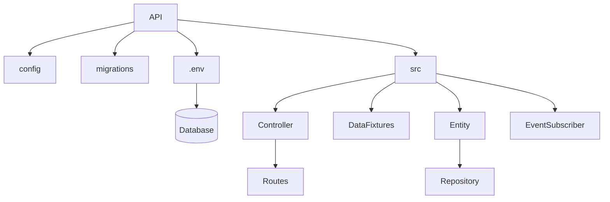

# Symfony REST API

This document is based on the OpenClassrooms [REST API course](https://openclassrooms.com/en/courses/7709361-construisez-une-api-rest-avec-symfony).

## Contents

- [Symfony REST API](#symfony-rest-api)
  - [Contents](#contents)
  - [Initialize the project](#initialize-the-project)
  - [File structure](#file-structure)
  - [Start/stop the server](#startstop-the-server)
  - [Create the database](#create-the-database)
  - [Create an entity](#create-an-entity)
  - [Create an entity relation](#create-an-entity-relation)
    - [Create groups (handle circular references)](#create-groups-handle-circular-references)
  - [Migrate an entity to the database](#migrate-an-entity-to-the-database)
    - [Revert to last migration](#revert-to-last-migration)
  - [Create fixtures](#create-fixtures)
  - [Create a controller](#create-a-controller)
    - [Create a route](#create-a-route)
    - [Routes common practices](#routes-common-practices)
  - [CRUD](#crud)
    - [Read all](#read-all)
    - [Read one](#read-one)
    - [Delete](#delete)
    - [Create](#create)
    - [Update](#update)
  - [Create an error handler](#create-an-error-handler)
  - [Authentication](#authentication)
    - [JWT](#jwt)
  - [Call an external API](#call-an-external-api)
    - [Read](#read)
    - [Persist in the database](#persist-in-the-database)
  - [Pagination](#pagination)
  - [Cache system](#cache-system)
  - [Autodiscovery](#autodiscovery)
  - [Versioning](#versioning)
  - [Documentation with Nelmio](#documentation-with-nelmio)
    - [Annotations](#annotations)
  - [Consider abstractions](#consider-abstractions)

## Initialize the project

```terminal
symfony new projectName --webapp --docker --cloud
```

This presupposes that all necessary apps to run the project are already installed: 

Git, PHP, Symfony, Composer, XAMPP, Insomnia...

Use the `--webapp` flag to install all useful bundles.

Use the `--docker` flag to prepate the project for containerization.

Use the `--cloud` flag to prepare the project for deployment on platform.sh.

This creates a ~100MB boilerplate.

While installing bundles individually can save space, it's more efficient to use the flags.

## File structure



## Start/stop the server

```terminal
symfony server:start -d
```

```terminal
symfony server:stop
```

## Create the database

Use the `.env` file as a template (do not write sensible data on it as it will be visible on GitHub).

1. Clone it and name it `.env.local` (or `.env.dev`, `env.prod`).

2. Declare the path and name of the database:

```terminal
DATABASE_URL="mysql://root:@127.0.0.1:3306/databaseName"
```

3. Create the database in mySQL:

```terminal
symfony console doctrine:database:create
```

4. Check if the connection is successful (should return 1):

```terminal
symfony console dbal:run-sql "SELECT 1"
```

## Create an entity

```terminal
symfony console make:entity
```

This creates a file in the `Entity` dir with the data model.

And a file in the `Repository` dir with the database querying code.

## Create an entity relation

### Create groups (handle circular references)

```php
#[ORM\Column(length: 255)]
#[Groups(['getBooks', 'getAuthors'])]
private ?string $firstName = null;
```

This declares variable grouping within an entity.

```php
$jsonBook = $serializer->serialize($book, 'json', ['groups' => 'getBooks']);
```

This declares which groups to use within the controller.

## Migrate an entity to the database

```terminal
symfony console make:migration
```

This creates a file in the `migrations` dir with the SQL code to alter the database.

It's good practice to read and verify it.

```terminal
symfony console doctrine:migrations:migrate
```

If successful, check the database for confirmation (e.g. phpmyadmin).

### Revert to last migration

```terminal
symfony console doctrine:migrations:execute DoctrineMigrations\Version20231002114820 --down
```

## Create fixtures

Install Faker PHP for more realistic test data:

```terminal
composer require fakerphp/faker
```

If no `DataFixtures` dir exists on `src`, run:

```terminal
composer require orm-fixtures --dev
```

Add custom fixtures to populate your tables (migrated entities):

```php
 class AppFixtures extends Fixture
14     {
15         private $userPasswordHasher;
16     
17         public function __construct(UserPasswordHasherInterface $userPasswordHasher)
18         {
19             $this->userPasswordHasher = $userPasswordHasher;
20         }
21     
22         public function load(ObjectManager $manager): void
23         {
24     
25             $faker = Factory::create();
26     
27             // User
28             $user = new User();
29             $user->setEmail('user@bookapi.com');
30             $user->setRoles(['ROLE_USER']);
31             $user->setPassword($this->userPasswordHasher->hashPassword($user, "password"));
32             $manager->persist($user);
33     
34             // Admin
35             $admin = new User();
36             $admin->setEmail('admin@bookapi.com');
37             $admin->setRoles(['ROLE_ADMIN']);
38             $admin->setPassword($this->userPasswordHasher->hashPassword($admin, "password"));
39             $manager->persist($admin);
40     
41             // Author
42             $listAuthor = [];
43             for ($i = 0; $i < 5; $i++) {
44                 // Create an author
45                 $author = new Author();
46                 $author->setFirstName($faker->firstName());
47                 $author->setLastName($faker->lastName());
48                 $manager->persist($author);
49                 // Store it in an array for random picking
50                 $listAuthor[] = $author;
51             }
52     
53             // Book
54             for ($i = 0; $i < 10; $i++) {
55                 $book = new Book;
56                 $book->setTitle($faker->sentence(3, true));
57                 $book->setCoverText($faker->paragraph());
58                 $publicationDate = new \DateTime($faker->date());
59                 $book->setPublicationDate($publicationDate);
60                 $book->setAuthor($listAuthor[array_rand($listAuthor)]);
61                 $manager->persist($book);
62             }
63     
64             $manager->flush();
65         }
66     }
```

```terminal
symfony console doctrine:fixtures:load
```

If successful, check the database for confirmation (e.g. phpmyadmin).

## Create a controller

```terminal
symfony console make:controller ControllerName
```

This creates a controller boilerplate where you can specify routes and their functions.

### Create a route

```php
#[Route('/books', name: 'book', methods: ['GET'])]
```

### Routes common practices

1. Set a global `/apiName` prefix before the class:

```php
#[Route('/apiName')]
class BookController extends AbstractController
{
```

2. Use plurals for general categories (e.g. `/api/books`).

3. Return a `JsonResponse` instead of any `Response`.

4. Use `return new JsonResponse()` instead of `return $this->json()`.

5. Use `methods: ['GET']` to specify that only GET requests can be processed.

## CRUD

### Read all

```php
#[Route('/books', name: 'book', methods: ['GET'])]
public function getAll(BookRepository $bookRepository, SerializerInterface $serializer): JsonResponse
    {

        $bookList = $bookRepository->findAll();
        $jsonBookList = $serializer->serialize($bookList, 'json', ['groups' => 'getBooks']);

        return new JsonResponse($jsonBookList, Response::HTTP_OK, [], true);
    }
```

### Read one

```php
#[Route('/books/{id}', name: 'detailBook', methods: ['GET'])]
public function getBook(Book $book, SerializerInterface $serializer): JsonResponse
    {
        $jsonBook = $serializer->serialize($book, 'json', ['groups' => 'getBooks']);
        
        return new JsonResponse($jsonBook, Response::HTTP_OK, [], true);
    }
```

### Delete

```php
#[Route('/books/{id}', name: 'deleteBook', methods: ['DELETE'])]
public function deleteBook(Book $book, EntityManagerInterface $em): JsonResponse
{
    $em->remove($book);
    $em->flush();

    return new JsonResponse(null, Response::HTTP_NO_CONTENT);
}
```

### Create

```php
#[Route('/books', name: 'createBook', methods: ['POST'])]
#[IsGranted('ROLE_ADMIN', message: 'You don\'t have access.')]
public function createBook(Request $request, SerializerInterface $serializer, EntityManagerInterface $em, UrlGeneratorInterface $urlGenerator, AuthorRepository $authorRepository, ValidatorInterface $validator): JsonResponse
{

    $book = $serializer->deserialize($request->getContent(), Book::class, 'json');

    // Error verification
    $errors = $validator->validate($book);

    if ($errors->count() > 0) {
        return new JsonResponse($serializer->serialize($errors, 'json'), Response::HTTP_BAD_REQUEST, [], true);
    }

    $content = $request->toArray();
    $idAuthor = $content['idAuthor'] ?? -1;

    $book->setAuthor($authorRepository->find($idAuthor));

    $em->persist($book);
    $em->flush();

    $jsonBook = $serializer->serialize($book, 'json', ['groups' => 'getBooks']);
    $location = $urlGenerator->generate('detailBook', ['id' => $book->getId()], UrlGeneratorInterface::ABSOLUTE_URL);

    return new JsonResponse($jsonBook, Response::HTTP_CREATED, ["location" => $location], true);
}
```

### Update

```php
#[Route('/books/{id}', name: 'updateBook', methods: ['PUT'])]
public function updateBook(Book $currentBook, Request $request, SerializerInterface $serializer, EntityManagerInterface $em, AuthorRepository $authorRepository): JsonResponse
{
    $updatedBook = $serializer->deserialize($request->getContent(), Book::class, 'json', [AbstractNormalizer::OBJECT_TO_POPULATE => $currentBook]);

    $content = $request->toArray();
    $idAuthor = $content['idAuthor'] ?? -1;

    $updatedBook->setAuthor($authorRepository->find($idAuthor));

    $em->persist($updatedBook);
    $em->flush();

    $jsonUpdatedBook = $serializer->serialize($updatedBook, 'json', ['groups' => 'getBooks']);
    return new JsonResponse($jsonUpdatedBook, Response::HTTP_OK, [], true);
}
```

## Create an error handler

```terminal
symfony console make:subscriber
```

This creates a subscriber (listener) file in the `EventSubscriber` dir within ```src```, listening to all exceptions.

```php
class ExceptionSubscriber implements EventSubscriberInterface
{
  public function onKernelException(ExceptionEvent $event): void
  {
      $exception = $event->getThrowable();

      if ($exception instanceof HttpException) {
          $data = [
              'status' => $exception->getStatusCode(),
              'message' => $exception->getMessage()
          ];

          $event->setResponse(new JsonResponse($data));
      } else {
          $data = [
              'status' => 500,
              'message' => $exception->getMessage()
          ];

          $event->setResponse(new JsonResponse($data));
      }
  }

  public static function getSubscribedEvents(): array
  {
      return [
          KernelEvents::EXCEPTION => 'onKernelException',
      ];
  }
}
```

```php
#[Assert\NotBlank(message: 'Please enter a title.')]
```

Use annotations to show a message for example.

## Authentication

```terminal
symfony console make:user
```

A user entity should have at least:

```php
#[ORM\Id]
#[ORM\GeneratedValue]
#[ORM\Column]
private ?int $id = null;

#[ORM\Column(length: 180, unique: true)]
private ?string $email = null;

#[ORM\Column]
private array $roles = [];

/**
 * @var string The hashed password
 */
#[ORM\Column]
private ?string $password = null;
```

```php
private $userPasswordHasher;

public function __construct(UserPasswordHasherInterface $userPasswordHasher)
{
    $this->userPasswordHasher = $userPasswordHasher;
}

public function load(ObjectManager $manager): void
{

    $faker = Factory::create();

    // User
    $user = new User();
    $user->setEmail('user@bookapi.com');
    $user->setRoles(['ROLE_USER']);
    $user->setPassword($this->userPasswordHasher->hashPassword($user, "password"));
    $manager->persist($user);

    // Admin
    $admin = new User();
    $admin->setEmail('admin@bookapi.com');
    $admin->setRoles(['ROLE_ADMIN']);
    $admin->setPassword($this->userPasswordHasher->hashPassword($admin, "password"));
    $manager->persist($admin);
```

`UserPasswordHasherInterface` is a Symfony class to hash password effectively.

Setting roles like `['ROLE_USER']` and `['ROLE_ADMIN']` allows to block routes.

### JWT

```terminal
composer require lexik/jwt-authentication-bundle
```

JWT work with a public key (encoding) and a private key (decoding).

Create a `jwt` dir in the config dir.

Using Git Bash,
```terminal
openssl genpkey -out config/jwt/private.pem -aes256 -algorithm rsa -pkeyopt rsa_keygen_bits:4096
```

This creates the private key.

```terminal
openssl pkey -in config/jwt/private.pem -out config/jwt/public.pem -pubout
```

This creates the public key.

Key generation asks for a `passphrase`.

```yaml
// env.local

###> lexik/jwt-authentication-bundle ###
JWT_SECRET_KEY=%kernel.project_dir%/config/jwt/private.pem
JWT_PUBLIC_KEY=%kernel.project_dir%/config/jwt/public.pem
JWT_PASSPHRASE=your_passphrase
###< lexik/jwt-authentication-bundle ###
```

```yaml
#  security.yaml

# main:
#     lazy: true
#     provider: app_user_provider

login:
    pattern: ^/api/login
    stateless: true
    json_login:
    check_path: /api/login_check
    success_handler: lexik_jwt_authentication.handler.authentication_success
    failure_handler: lexik_jwt_authentication.handler.authentication_failure
api:
    pattern: ^/api
    stateless: true
    jwt: ~

```

```yaml
access_control:
# - { path: ^/admin, roles: ROLE_ADMIN }
# - { path: ^/profile, roles: ROLE_USER }
- { path: ^/api/login, roles: PUBLIC_ACCESS }
- { path: ^/api/doc, roles: PUBLIC_ACCESS }
- { path: ^/api/external, roles: PUBLIC_ACCESS }
- { path: ^/api, roles: IS_AUTHENTICATED_FULLY }
```

```yaml
# config/routes.yaml
api_login_check:
  path: /api/login_check

```

```php
use Symfony\Component\Security\Http\Attribute\IsGranted;

#[Route('/books', name: 'createBook', methods: ['POST'])]
#[IsGranted('ROLE_ADMIN', message: 'You don\'t have access.')]
```

This blocks a route depending on user role.

## Call an external API

```terminal
symfony console make:controller ExternalApiController
```

This creates a controller that can be used as an Http client.

### Read

```php
#[Route('/planets', name: 'app_external_api', methods: 'GET')]
public function getStarWarsPlanets(HttpClientInterface $client): JsonResponse
{
    $response = $client->request(
        'GET',
        'https://swapi.dev/api/planets'
    );

    return new JsonResponse($response->getContent(), $response->getStatusCode(), [], true);
}
```

### Persist in the database

```php
#[Route('/planets', name: 'app_external_api', methods: 'POST')]
public function persistStarWarsPlanets(HttpClientInterface $client, EntityManagerInterface $em): JsonResponse
{
    $faker = Factory::create();

    $response = $client->request(
        'GET',
        'https://swapi.dev/api/planets'
    );

    $content = json_decode($response->getContent(), true);
    $limited_content = array_slice($content['results'], 0, 10);

    foreach ($limited_content as $e) {

        $book = new Book;
        $name = $e['name'];
        $summary = $e['climate'];

        // dump($name);

        $book->setTitle($name);
        $book->setCoverText($summary);
        $publicationDate = new \DateTime($faker->date());
        $book->setPublicationDate($publicationDate);

        $em->persist($book);
    }

    $em->flush();

    return new JsonResponse('Items created', Response::HTTP_CREATED, [], false);
}
```

## Pagination

```php
public function findAllWithPagination($page, $limit)
{
    $query = $this->createQueryBuilder('b')
        ->setFirstResult(($page - 1) * $limit)
        ->setMaxResults(($limit));

    $totalBooks = count($this->findAll());
    $totalPages = ceil($totalBooks / $limit);
    $paginatedBooks = $query->getQuery()->getResult();

    return ['currentPage' => intval($page), 'totalPages' => intval($totalPages), 'authors' => $paginatedBooks];
}
```

This creates a custom query in the repository.

```php
#[Route('/authors', name: 'author', methods: ['GET'])]
public function getAuthorList(AuthorRepository $authorRepository, SerializerInterface $serializer, Request $request): JsonResponse
{

    $page = $request->get('page', 1);
    $limit = $request->get('limit', 3);
    
    $authorList = $authorRepository->findAllWithPagination($page, $limit);
    $jsonAuthorList = $serializer->serialize($authorList, 'json', ['groups' => 'getAuthors']);

    return new JsonResponse($jsonAuthorList, Response::HTTP_OK, [], true);
}
```

## Cache system

```php
public function getBooks(Request $request, TagAwareCacheInterface $cache, BookRepository $bookRepository, SerializerInterface $serializer): JsonResponse
{

    $page = $request->get('page', 1);
    $limit = $request->get('limit', 3);

    $idCache = 'getBooks-' . $page . "-" . $limit;

    // $bookList = $this->bookRepository->findAll();
    // $bookList = $this->bookRepository->findAllWithPagination($page, $limit);

    $jsonBookList = $cache->get($idCache, function (ItemInterface $item) use ($bookRepository, $page, $limit, $serializer) {
        echo ('Cache has been set!');
        $item->tag('booksCache');
        $bookList = $bookRepository->findAllWithPagination($page, $limit);
        return $serializer->serialize($bookList, 'json', ['groups' => 'getBooks']);
    });

    return new JsonResponse($jsonBookList, Response::HTTP_OK, [], true);
}
```

This sets a cache by storing data using an id and returning that stored data on call. 

/!\ Remember, using cache means displaying stored values and not real ones.

It is recommended to empty the cache on specific actions like `delete` or using time:

```php
#[Route('/books/{id}', name: 'deleteBook', methods: ['DELETE'])]
#[IsGranted('ROLE_ADMIN', message: 'You don\'t have access.')]
public function deleteBook(Book $book, EntityManagerInterface $em, TagAwareCacheInterface $cache): JsonResponse
{
    $cache->invalidateTags(['booksCache']);
    $em->remove($book);
    $em->flush();

    return new JsonResponse(null, Response::HTTP_NO_CONTENT);
}
```

```php
$jsonBookList = $cache->get($idCache, function (ItemInterface $item) use ($bookRepository, $page, $limit, $serializer) {
  echo ('Cache has been set!');
  $item->tag('booksCache');
  // Expires after x time
  $item->expiresAfter(5);
  $bookList = $bookRepository->findAllWithPagination($page, $limit);
  return $serializer->serialize($bookList, 'json', ['groups' => 'getBooks']);
});
```

## Autodiscovery

```php
private ?array $links = null;
```

```php
public function getLink(): ?array
{
    return $this->links;
}

public function addLink(?string $method, ?string $path)
{
    $this->links[] = ['method' => $method, 'path' => $path];

    return $this;
}
```

This creates a private variable and a public setter and getter `links`.

```php
public function findAllWithPagination($page, $limit)
{
    $query = $this->createQueryBuilder('b')
        ->setFirstResult(($page - 1) * $limit)
        ->setMaxResults(($limit));

    $totalBooks = count($this->findAll());
    $totalPages = ceil($totalBooks / $limit);
    $paginatedBooks = $query->getQuery()->getResult();

    $discoverableBooks = [];

    foreach ($paginatedBooks as $book) {
        $bookId = $book->getId();
        $book->addLink('post', '/books/' . $bookId);
        $book->addLink('put', '/books/' . $bookId);
        $book->addLink('delete', '/books/' . $bookId);
        $discoverableBooks[] = [
            'book' => $book,
            'links' => $book->getLink()
        ];
    }

    return ['currentPage' => intval($page), 'totalPages' => intval($totalPages), 'books' => $discoverableBooks];
}
```

In the repository, create an empty array `$discoverableBooks`.

Set a `foreach` loop over the query results, setting the desired links.

Output `$discoverableBooks`.

## Versioning

When scaling an API, it's possible to provide a stable version, while deploying a beta version.

[More info](https://openclassrooms.com/en/courses/7709361-construisez-une-api-rest-avec-symfony/7795174-versionnez-votre-api)

## Documentation with Nelmio

```terminal
composer require nelmio/api-doc-bundle
``` 

If Twig asset is missing:

```terminal
composer require twig asset
```

```yaml
# security.yaml

access_control:
# - { path: ^/admin, roles: ROLE_ADMIN }
# - { path: ^/profile, roles: ROLE_USER }
- { path: ^/api/login, roles: PUBLIC_ACCESS }
- { path: ^/api/doc, roles: PUBLIC_ACCESS }
- { path: ^/api, roles: IS_AUTHENTICATED_FULLY }
```

```yaml
# nelmio_api_doc.yaml

nelmio_api_doc:
documentation:
info:
    title: My App
    description: This is an awesome app!
    version: 1.0.0

paths:
    /api/login_check:
    post:
        tags:
        - Token
        operationId: postCredentialsItem
        summary: Obtain a JWT.
        requestBody:
        content:
            application/json:
            schema:
                $ref: "#/components/schemas/Credentials"
        responses:
        "200":
            description: Obtain a token
            content:
            application/json:
                schema:
                $ref: "#/components/schemas/Token"

components:
    schemas:
    Token:
        type: object
        properties:
        token:
            type: string
            readOnly: true

    Credentials:
        type: object
        properties:
        username:
            type: string
            default: admin@bookapi.com
        password:
            type: string
            default: password

    securitySchemes:
    bearerAuth:
        type: apiKey
        in: header
        name: Authorization

security:
    - bearerAuth: []

areas: # to filter documented areas
path_patterns:
    - ^/api(?!/doc$) # Accepts routes under /api except /api/doc

```

```url
https://localhost:8000/api/doc
```

### Annotations

```php
use Nelmio\ApiDocBundle\Annotation\Model;
use Nelmio\ApiDocBundle\Annotation\Security;
use OpenApi\Annotations as OA;
```

```php
/**
     * Description goes here.
     *
     * @OA\Response(
     *     response=200,
     *     description="Description here",
     *     @OA\JsonContent(
     *        type="array",
     *        @OA\Items(ref=@Model(type=Book::class, groups={"getBooks"}))
     *     )
     * )
     * @OA\Parameter(
     *     name="page",
     *     in="query",
     *     description="La page que l'on veut récupérer",
     *     @OA\Schema(type="int")
     * )
     *
     * @OA\Parameter(
     *     name="limit",
     *     in="query",
     *     description="Le nombre d'éléments que l'on veut récupérer",
     *     @OA\Schema(type="int")
     * )
     * @OA\Tag(name="Books")
     *
     * @param BookRepository $bookRepository
     * @param SerializerInterface $serializer
     * @param Request $request
     * @return JsonResponse
     */
```

## Consider abstractions

When developing the API, the main goal is to keep the code understandable. 

Use abstraction (code bundling, e.g. services) only when needed, whenever code can really be reused.

Over-abstraction can ultimately lead to time waste and file complexity.
